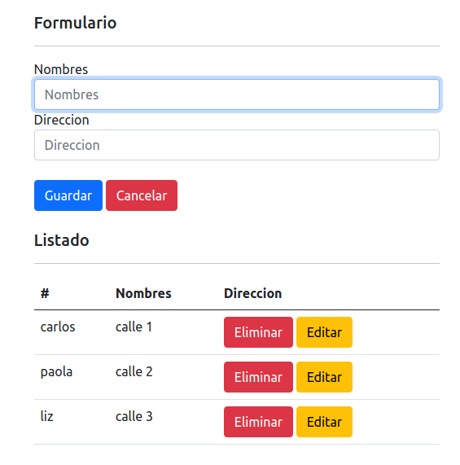

# Project Learning Javascript - Node
Computer Version:

[](https://www.microsoft.com/es-es/windows/windows-11?r=1)
[](https://ubuntu.com/)
[](https://www.apple.com/la/mac/)

> <strong> Backend and frontend project using node express and javascript html.</strong>




[](https://expressjs.com/es/)
[](https://www.javascript.com/)
[](https://developer.mozilla.org/es/docs/Web/HTML)
[](https://www.npmjs.com/)
[](https://nodejs.org/es/)
[](https://github.com/)
[](https://git-scm.com/)
[](https://www.linux.org/)
[](https://www.microsoft.com/es-es/windows/windows-11?r=1)
[](https://code.visualstudio.com/)


## 💻 Pre requirements


To use the project on your machine, you must have the following installed:

* Have installed nodejs higher than v14.

## ☕ Requirements <learning_js_node>


To start the project <learning_js_node>, you must follow the following steps:

1. Open a terminal at the root of the project.
2. Run the following command:
    ```
    cd backend
    ```
2. In the main root of the project backend execute the following in your terminal:
    ```
    npm install
    ```
## 🚀 Start project <learning_js_node>

To start the project <learning_js_node>, you must follow the following steps:
* Open a terminal at the root of the project.
* Run the following command inside the backend folder:
    ```
    npm run test
    ```
* Open in your preferred browser the index.html file located inside the frontend folder.


<div align="center">

### My social accounts


[](https://twitter.com/harlericho)
[](https://github.com/harlericho)
[](https://hub.docker.com/u/harlericho)

</div>

<p align="center"><strong>Copyright © 2022 Harlericho</strong></p>